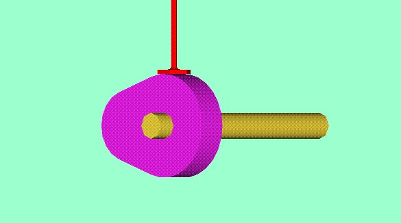

# CamFollowerJS
Generator and simulator of cams profiles for cam/follower mechanisms.

**This page can work also offline on your PC**

This page allows creating cam profiles for cam/follower mechanisms used in automata. The cam can be started from scratch, or loaded from an existing file, edited and saved again.

The page loads the flat cartesian profile of the cam, and turns it into a circular/polar profile, the it starts rotating the cam as per aramters specified in the file itself (direction and speed) and shows how a follower follows the cam profile. Note: current version does not perform any check on output, so resulting cams could be impossible to realize in practice.

----------

Theory of cams/followers:

https://www.researchgate.net/figure/Schematic-of-the-cam-follower-mechanism-adapted-from-Ref-33-The-cam-rotates-about_fig8_279290006

 - [Nonlinear Passive Cam-Based Springs for Powered Ankle Prostheses](https://www.researchgate.net/publication/279290006_Nonlinear_Passive_Cam-Based_Springs_for_Powered_Ankle_Prostheses)

- [MACHINE THEORY
Bachelor in Mechanical Engineering
CAMS DESIGN II](http://ocw.uc3m.es/ingenieria-mecanica/machine-theory/lectures-1/cams-design-ii)

https://www.softintegration.com/chhtml/toolkit/mechanism/cam/cgi_trans_sample.html

3d cam example:

https://mechtics.com/machine/mechanics-of-machines/cam-and-follower-mechanism-types-and-functions/

3d printing
-----------

In the future CamFollowerJS will implement export in  STL format for 3d printing. In the meantime you can use some online service to convert the SVG output to STL:
 - https://rawgit.com/ryancalme/svg-to-stl/master/SVGtoSTL.html  (source: https://github.com/rcalme/svg-to-stl )
 - http://svg2stl.com/

Versions history
---------------

0.1.0 First public version; many things yet on the todo list:
 - 	editable flat path;
 - 	export in SVG format;
 - 	export in STL format;
 - 	tunable rotation speed/direction;
 - 	add speed chart, angle chart, acceleration chart,...

Known problems:
  - 	Can't handle properly two points at same angle in flat path

0.1.1
 - Added visual and numeric pressure angle

0.1.2 
 -  Added export to SVG format; please use one of these services to convert to STL:
    - https://rawgit.com/ryancalme/svg-to-stl/master/SVGtoSTL.html  (source: https://github.com/rcalme/svg-to-stl )
    - http://svg2stl.com/  
